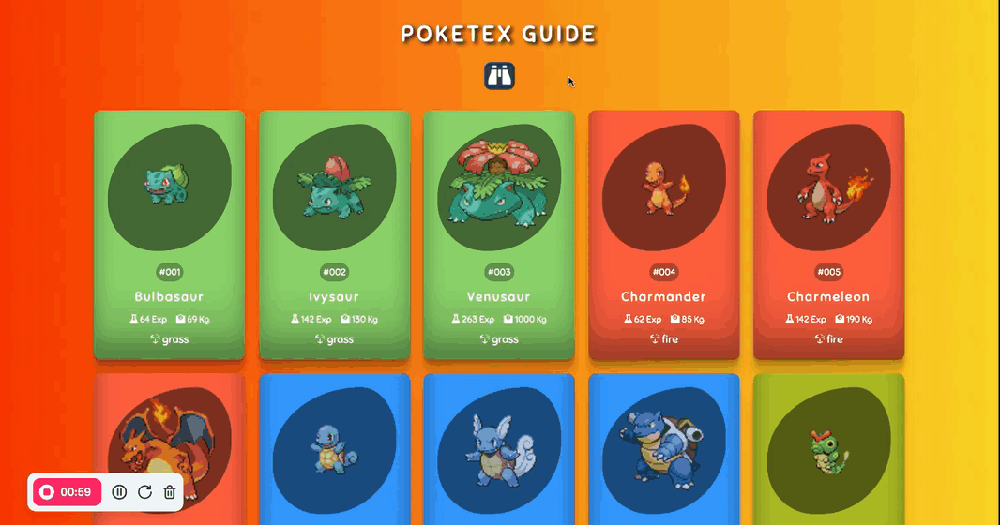

## Pokémon Kılavuzu

Bu proje, Pokémon karakterlerini detaylı bir şekilde gösteren modern bir web tabanlı Pokedex uygulamasıdır.

# Özellikler

• Pokémon karakter kartları
• Her karakterin detaylı bilgileri (ağırlık, deneyim, tür)
• Renkli ve kategoriye göre tasarlanmış kartlar
• Responsive tasarım

## Teknolojiler

• HTML5
• CSS3
• JavaScript

## Ekran Görüntüsü

Yukarıdaki metni, paylaşmak istediğiniz projenize uyarlayabilirsiniz. Eğer bir ekleme veya çıkarma yapmak isterseniz, belirtmeniz yeterli!
